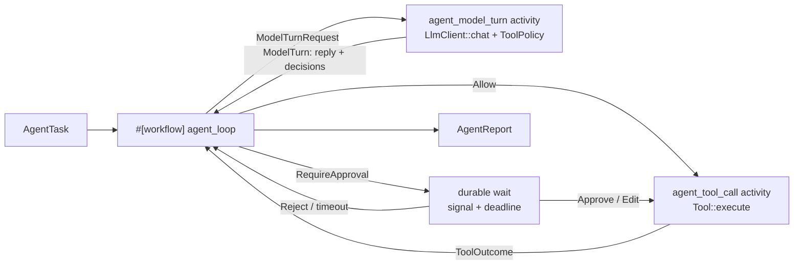

# Design — Issue #1973: a Rust-native agent adapter

Issue #1973 asks for an adapter that runs an agent framework on the engine.
The agent loop is a workflow. Each model call and each tool call is an
activity. A human approval is a durable wait.

**No migration. No new `WorkflowEvent` variant. No route change.**

---

## 0. Planning record

### 0.1 Brainstorm — which framework, and where does the adapter live?

| # | Idea | Verdict |
|---|------|---------|
| B1 | Target `rig-core`. | Rejected. It has no approval primitive and no tool-effect model. Its agent loop is not split into steps that an activity can own. |
| B2 | Target `autumn-plugin-agent` 0.2 as published. | Rejected. That version needs `autumn-web`, and the issue forbids it. |
| B3 | Target `autumn-plugin-agent` 0.3. Put `autumn-web` behind a default `autumn` feature. | **Adopted.** The crate has a provider-neutral `LlmClient`, a `Tool` trait with `ToolEffect`, a `ToolPolicy` with allow, ask and deny, and a serialisable `Approval`. Each one maps to an engine primitive. |
| B4 | Copy the plugin-agent primitives into the engine. | Rejected. Two copies drift, and the issue asks for an adapter, not a fork. |
| B5 | Put the adapter in `autumn-harvest-plugin`. | Rejected. That crate needs `autumn-web`. |
| B6 | A new crate, `autumn-harvest-agent`, on the core crate with no default features. | **Adopted.** It works on Postgres and on SQLite. |
| B7 | Evaluate the tool policy in the workflow. | Rejected. A policy is async and can read state. Replay must not ask it again. |
| B8 | Evaluate the tool policy in the model-turn activity, and record each decision with the reply. | **Adopted.** Replay reads the recorded decision. |
| B9 | Record the plugin-agent `ChatResponse` in history. | Rejected. That type has no serde contract. An upstream change would break replay. The adapter owns its history types. |

### 0.2 Reverse brainstorm — how can this adapter do harm?

| # | How to make it harmful | Mitigation |
|---|------------------------|------------|
| R1 | Re-run a paid model call after a crash. | The reply is an activity result. Replay reads it. A crash test proves it in a separate process. |
| R2 | Re-run a tool that already wrote. | A completed tool call is an activity result. Only an uncommitted call runs again. `ToolContext` carries `run_id` and `call_id` as an idempotency key. |
| R3 | Let a late approval release a later call. | The signal name holds the step, the position and the call id. Each name is unique to one wait. |
| R4 | Block forever on an approval nobody sends. | The wait has a durable deadline. A timeout denies the call, and the model sees why. |
| R5 | Let the policy change its answer on replay. | The decision is part of the recorded reply. |
| R6 | Fail a run after the model was paid, because the next request is too large. | The loop measures the request first and stops with `TranscriptFull`. |
| R7 | Retry an authentication failure forever. | The activity marks it non-retryable. Only rate limits and transport faults retry. |
| R8 | Pull `autumn-web` in through the back door. | A CI script runs `cargo tree` and fails if `autumn-web` is in the adapter graph. |
| R9 | Leak the API key into history. | The key lives in the client. History holds messages only. |
| R10 | Run an unknown tool name. | The tool activity answers with an error result. The policy sees `tool: None`. |

### 0.3 Six thinking hats

- **White (facts).** The engine has workflows, activities, signals with
  timeouts, and the SQLite backend. Plugin-agent 0.2 has the agent
  primitives, but it needs `autumn-web`. Cargo-deny forbids git sources, so the
  engine can use plugin-agent only from crates.io.
- **Red (feelings).** A user wants one call that makes an agent durable. A
  second loop to learn is friction.
- **Black (risks).** The engine PR waits until plugin-agent 0.3.0 is on
  crates.io. Replay breaks if a history type changes shape. The daemon has
  12 000 lines of tests, and a rewrite can break them.
- **Yellow (benefits).** One adapter serves every provider that plugin-agent
  serves. A crash costs at most the one uncommitted step.
- **Green (ideas).** The policy decision rides with the reply. The approval
  payload is the plugin-agent `Approval`, so approve, edit and reject all work.
  The daemon takes the extracted approval and payload-cap parts and keeps its
  Anthropic-native turn.
- **Blue (process).** Split plugin-agent first. Then write the adapter tests
  (RED), the adapter (GREEN), and the clean-up (REFACTOR). Then move the daemon
  onto the extracted parts, and write the ADR and the guide.

---

## 1. Decision

The target framework is `autumn-plugin-agent`. ADR 0006 records why.

## 2. Design

- `AgentHarness` holds the `LlmClient`, the tools and the policy. Postgres
  reads it with `ActivityContext::state`. SQLite gets it through
  `sqlite::register`.
- The workflow reads only recorded results, so replay is deterministic.
- The history types (`ModelTurn`, `ToolOutcome`, `AgentReport`) belong to the
  adapter, so a plugin-agent change cannot alter a stored payload.
- The daemon example uses `approval` and `bounds` from the adapter.

## 3. Test plan

| Test | Proves |
|------|--------|
| `crash_mid_loop_resumes_without_rerunning_completed_calls` | A child process aborts inside a tool call. The parent resumes the run. No completed model or tool call runs again. |
| `approval_*` | Approve, edit, reject and timeout each reach the model as the correct result. |
| `policy_decision_is_recorded_with_the_turn` | Replay does not ask the policy again. |
| `*_budget_*` | Step, token and transcript bounds stop the run with a named reason. |
| `model_errors_are_classified` | Rate limits retry. Authentication failures do not. |
| proptest `approval_signal_round_trips` | A signal name gives back its call id, for any id. |
| `scripts/check-agent-adapter-no-autumn-web.sh` | The adapter graph has no `autumn-web`. |
