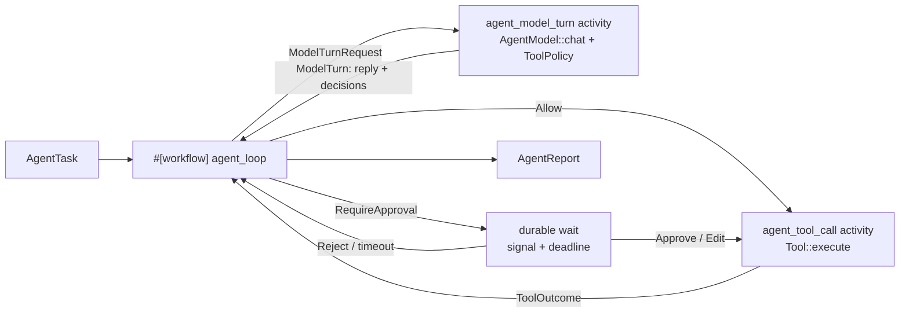

# Design — Issue #1973: a Rust-native agent adapter

Issue #1973 asks for an adapter that runs an agent framework on the engine.
The agent loop is a workflow. Each model call and each tool call is an
activity. A human approval is a durable wait.

**No migration. No new `WorkflowEvent` variant. No route change.**

---

## 0. Planning record

### 0.1 Brainstorm — which framework, and where does the adapter live?

| # | Idea | Verdict |
|---|------|---------|
| B1 | Target `rig-core`. | Rejected. It has no approval primitive and no tool-effect model. Its agent loop is not split into steps that an activity can own. |
| B2 | Target `autumn-plugin-agent` 0.2 as published. | Rejected. That version needs `autumn-web`, and the issue forbids it. |
| B3 | Target `autumn-plugin-agent` 0.3. Put `autumn-web` behind a default `autumn` feature. | Tried, then rejected in review (see §0.4). Harvest would rely on two Autumn plugins. |
| B4 | Own a small agent contract in the engine. Use the plugin-agent primitives as the guide for its shape. | **Adopted** (see §0.4). Each primitive maps to an engine primitive, and the engine owns its history types. |
| B5 | Put the adapter in `autumn-harvest-plugin`. | Rejected. That crate needs `autumn-web`. |
| B6 | A new crate, `autumn-harvest-agent`, on the core crate with no default features. | **Adopted.** It works on Postgres and on SQLite. |
| B7 | Evaluate the tool policy in the workflow. | Rejected. A policy is async and can read state. Replay must not ask it again. |
| B8 | Evaluate the tool policy in the model-turn activity, and record each decision with the reply. | **Adopted.** Replay reads the recorded decision. |
| B9 | Record a framework's own response type in history. | Rejected. An upstream change would break replay. The adapter owns its history types. |

### 0.2 Reverse brainstorm — how can this adapter do harm?

| # | How to make it harmful | Mitigation |
|---|------------------------|------------|
| R1 | Re-run a paid model call after a crash. | The reply is an activity result. Replay reads it. A crash test proves it in a separate process. |
| R2 | Re-run a tool that already wrote. | A completed tool call is an activity result. Only an uncommitted call runs again. `ToolContext` carries `run_id` and `call_id` as an idempotency key. |
| R3 | Let a late approval release a later call. | The signal name holds the step, the position and the call id. Each name is unique to one wait. |
| R4 | Block forever on an approval nobody sends. | The wait has a durable deadline. A timeout denies the call, and the model sees why. |
| R5 | Let the policy change its answer on replay. | The decision is part of the recorded reply. |
| R6 | Fail a run after the model was paid, because the next request is too large. | The loop measures the request first and stops with `TranscriptFull`. |
| R7 | Retry an authentication failure forever. | The activity marks it non-retryable. Only rate limits, transport faults, outages and timeouts retry. |
| R8 | Pull `autumn-web` or an Autumn plugin in through the back door. | A CI script runs `cargo tree` and fails on any Autumn crate outside the engine. |
| R9 | Leak the API key into history. | The key lives in the client. History holds messages only. |
| R10 | Run an unknown tool name. | The tool activity answers with an error result. The policy sees `tool: None`. |

### 0.3 Six thinking hats

- **White (facts).** The engine has workflows, activities, signals with
  timeouts, and the SQLite backend. `autumn-plugin-agent` has good agent
  primitives, but it is an Autumn plugin.
- **Red (feelings).** A user wants one call that makes an agent durable. A
  second Autumn plugin under the engine feels wrong.
- **Black (risks).** Replay breaks if a history type changes shape. The
  daemon has 12 000 lines of tests, and a rewrite can break them.
- **Yellow (benefits).** One contract serves every provider. A crash costs
  at most the one uncommitted step.
- **Green (ideas).** The policy decision rides with the reply. The approval
  payload is an `Approval`, so approve, edit and reject all work. The daemon
  takes the approval names, the approval wait and the payload-cap checks.
- **Blue (process).** Write the adapter tests (RED), the adapter (GREEN),
  and the clean-up (REFACTOR). Then move the daemon onto the extracted parts,
  and write the ADR and the guide.

### 0.4 Revision after review

The first version depended on `autumn-plugin-agent` 0.3, with `autumn-web`
behind a new default feature. The maintainer rejected that: the engine must
not rely on two Autumn plugins. The plugin-agent primitives are a guide post,
not a dependency.

The adapter now owns `AgentModel`, `Tool`, `ToolPolicy`, `Approval` and the
message types. The loop, the activities and the tests did not change shape.
`scripts/check-agent-adapter-deps.sh` now fails on any Autumn crate outside
the engine.

---

## 1. Decision

The adapter owns its agent primitives, modelled on `autumn-plugin-agent`.
ADR 0006 records why.

## 2. Design

- `AgentHarness` holds the `AgentModel`, the tools and the policy. Postgres
  reads it with `ActivityContext::state`. SQLite gets it through
  `sqlite::register`.
- The workflow reads only recorded results, so replay is deterministic.
- The history types (`ModelTurn`, `ToolOutcome`, `AgentReport`) belong to the
  adapter, so no outside change can alter a stored payload.
- The daemon example uses `approval` and `bounds` from the adapter.

## 3. Test plan

| Test | Proves |
|------|--------|
| `crash_mid_loop_resumes_without_rerunning_completed_calls` | A child process aborts inside a tool call. The parent resumes the run. No completed model or tool call runs again. |
| `crash_inside_a_model_call_resends_only_that_call` | The same, with the abort inside a model call. |
| `an_approved_call_…`, `an_edited_call_…`, `a_rejected_call_…`, `a_missed_deadline_…`, `an_unreadable_decision_…` | Each decision reaches the model as the correct result. |
| `a_late_decision_for_one_wait_never_releases_another` | A late decision cannot release a later call. |
| `a_restart_replays_recorded_turns_and_recorded_policy_decisions` | Replay does not ask the policy again. |
| `the_step_budget_…`, `the_token_budget_…`, `a_transcript_too_large_…`, `a_round_whose_results_pass_the_cap_…`, `a_lower_request_cap_…` | Each bound stops the run with a named reason. |
| `retryable_kinds_are_marked_retryable`, `a_rate_limit_retries_and_an_auth_failure_does_not` | Rate limits, transport faults and outages retry. Other failures do not. |
| `the_engine_registration_builds`, `the_model_turn_handler_…` | The Postgres path: registration and the `#[activity]` handlers. |
| proptest `approval_signal_round_trips` | A signal name gives back its call id, for any id. |
| `scripts/check-agent-adapter-deps.sh` | The adapter depends on no Autumn crate outside the engine. |

---

## 4. Always-on primitives (follow-up)

`autumn-plugin-agent` has always-on primitives: heartbeats, follow-ups,
delivery, memory and a loop guard. This section maps them onto engine
primitives. The SQLite backend supports activities, signals and fire-once
timers, but not `continue_as_new`, child workflows or schedules. Every
primitive below therefore uses only those three.

### 4.1 Brainstorm

| # | Idea | Verdict |
|---|------|---------|
| A1 | Heartbeat as a workflow that loops forever on a timer. | Rejected. History grows without bound, and SQLite has no `continue_as_new`. |
| A2 | Heartbeat as a one-tick workflow `agent_heartbeat`. An engine schedule starts it on Postgres. The app starts it on SQLite. | **Adopted.** One tick is one bounded run. |
| A3 | Follow-up as a child workflow with a start delay. | Rejected. SQLite has no child workflows. |
| A4 | Follow-up as a durable timer in the same run, then a new segment with the follow-up prompt. A chain cap bounds it. | **Adopted.** The session stays one workflow. |
| A5 | Delivery inside the tool or model activity. | Rejected. A retried activity could deliver twice. |
| A6 | Delivery as its own activity, `agent_deliver`. | **Adopted.** It is recorded once. |
| A7 | Memory read by the workflow on each turn. | Rejected. It changes the prompt mid-run and breaks the cache. |
| A8 | Memory read once per segment by an activity, `agent_memory_snapshot`. | **Adopted.** It is a frozen snapshot, recorded in history. |
| A9 | Loop guard with `DefaultHasher`. | Rejected. Its output can change between Rust versions, so replay could differ. |
| A10 | Loop guard with FNV-1a over recorded data. | **Adopted.** It is stable across builds. |

### 4.2 Reverse brainstorm

| # | How to make it harmful | Mitigation |
|---|------------------------|------------|
| H1 | Deliver a report twice after a crash. | Delivery is an activity. Replay reads its record. |
| H2 | Let a heartbeat act on the world with nobody watching. | A heartbeat run is read-only unless the task sets `allow_actions`. The rules apply on top of the app policy. |
| H3 | Let an agent wake itself forever. | Follow-ups have a chain cap and a maximum delay. |
| H4 | Reuse an approval name across follow-up segments. | The step number is global across segments. |
| H5 | Spam the user with "nothing to report". | `HEARTBEAT_OK` answers are not delivered. |
| H6 | Change the memory prompt between replay and the first run. | The snapshot is an activity result. |

### 4.3 Six thinking hats

- **White.** The SQLite backend has timers but no schedules or
  `continue_as_new`. Postgres has both.
- **Red.** Always-on is the feature people want to show off. It must feel
  like one call per primitive.
- **Black.** History grows with each follow-up segment. The chain cap bounds
  it.
- **Yellow.** Each primitive becomes durable for free: a crash never loses a
  scheduled follow-up or delivers twice.
- **Green.** The follow-up tool is handled in the workflow, not by an
  activity, because it only schedules a timer.
- **Blue.** RED tests per primitive, then the code, then the guide.
