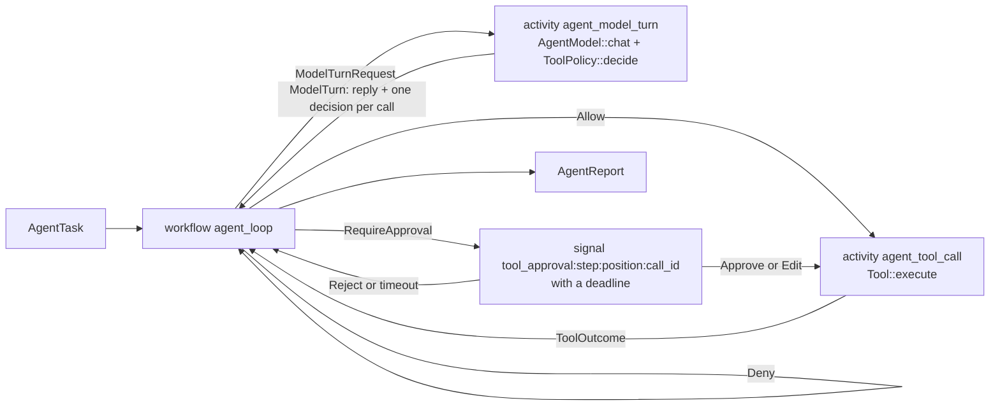

# Durable agents: the agent adapter

`autumn-harvest-agent` runs an agent as a durable workflow (issue #1973).
The agent loop is the workflow. Each model call and each tool call is an
activity. A human approval is a durable wait.

A crash costs at most the one step that was in flight. A restart reads every
completed model call, policy decision and tool call from history. It does not
pay for them again.

The crate owns its agent primitives: `AgentModel`, `Tool`, `ToolPolicy`,
`Approval` and the message types. They follow the shape of the
`autumn-plugin-agent` primitives, but the crate does not depend on it. It
depends on the core engine only, with no default features.
[ADR 0006](adr/0006-agent-adapter-framework.md) records why.

## 1. The mapping



| Agent concept | Engine primitive | What history records |
|---|---|---|
| The loop and its budgets | Workflow `agent_loop` | `AgentTask` in, `AgentReport` out |
| One model call | Activity `agent_model_turn` | The reply and the policy decision for each call |
| One tool call | Activity `agent_tool_call` | The tool result, cut to fit the result cap |
| "Ask a person first" | Signal with a deadline | The `Approval`, or the timeout |

## 2. Run it on SQLite

The example needs no API key and no network. It drives a run to its
approval wait, drops the runtime as a crash would, opens the file again,
approves, and finishes:

```sh
cargo run -p autumn-harvest-agent --features sqlite --example sqlite_agent
```

```text
waiting on tool_approval:0:1:write_1 for call Some("write_1")
  write_note ran with {"text":"remember the milk"}
stop:   Completed
answer: The note is saved.
model calls: 1 before the restart, 1 after it
```

The core of it:

```rust
use std::sync::Arc;
use autumn_harvest_agent::{AgentHarness, AgentTask, sqlite};
use autumn_harvest_sqlite::{RunState, SqliteRuntime};
use autumn_harvest_agent::Approval;

let mut rt = SqliteRuntime::open("agent.db")?;
sqlite::register(&mut rt, Arc::new(harness));
let exec = sqlite::start(&mut rt, &AgentTask::new("Save a note."))?;

if let RunState::WaitingSignal(signal) = rt.run_until_blocked(exec).await? {
    // Show the call to a person, then send the decision.
    sqlite::decide(&mut rt, exec, &signal, &Approval::Approve)?;
}
let state = rt.run_until_blocked(exec).await?;
```

The SQLite backend runs a synchronous activity body. `sqlite::register`
runs each async body with `block_in_place`, so use a multi-thread Tokio
runtime.

## 3. Run it on Postgres

Register the workflow and both activities. Install the harness as worker
state, because the activities read it with `ActivityContext::state`:

```rust
use autumn_harvest::builder::HarvestBuilder;
use autumn_harvest_agent::{AgentHarness, activities, workflows};

let harness = AgentHarness::new(client)
    .tool(lookup)
    .policy(Arc::new(ToolRules::new().effect(ToolEffect::Write, Rule::Ask)));

let built = HarvestBuilder::new()
    .workflows(workflows())
    .activities(activities())
    .state(harness)
    .build();
```

`workflows()` returns `agent_loop`. `activities()` returns `agent_model_turn`
and `agent_tool_call`. The test `the_engine_registration_builds` builds this
exact registration.

Start a run under the name `agent_loop` with an `AgentTask` as input. To
decide on a gated call, send a signal to the run. Build the name with
`approval::approval_signal(step, position, call_id)` from the recorded
`ModelTurn`, and send a serialised `Approval` as the payload. A worker with
no harness fails the call as `AgentHarnessMissing`, which is not retryable.

A worker with a payload cap other than the default must say so. Set
`AgentTask::max_request_bytes` to its activity-input cap, and
`AgentHarness::max_result_bytes` to its activity-result cap.

## 4. Build the harness

`AgentHarness` holds the parts that do real work:

- `new(model)` — any `AgentModel`. Implement its one `chat` method for your
  provider, or bridge a framework you already use. The crate ships no HTTP
  client.
- `tool(tool)` / `tools(iter)` — any `Tool`. `FnTool` wraps an async
  function.
- `policy(policy)` — any `ToolPolicy`. The default is `AllowAll`.
  `ToolRules` gives per-tool and per-effect rules.
- `temperature(t)` — the sampling temperature of each call.
- `tool_output_limit(chars)` — the cap on one tool result. The default is
  8 000 characters.
- `max_result_bytes(bytes)` — the activity-result cap of the workers. A
  larger tool result is cut to fit it. The default is the engine default.
- `model_timeout(d)` — the time budget of one model call. The default is
  13 minutes. With the policy budget, it stays below the 15-minute
  `start_to_close`. A call over it is a
  retryable failure.
- `tool_timeout(d)` — the time budget of one tool call. The default is
  9 minutes, below the 10-minute `start_to_close`. A call over it is an
  error result that the model reads.
- `policy_timeout(d)` — the time budget of the policy for all calls of one
  turn. The default is one minute. A call with no decision when the budget
  ends is denied, and the decision is recorded.

A tool error is cut to fit the result cap too, so a huge error message
cannot fail the run.

### The cost ledger

On Postgres, each model turn writes one row to the
[agent cost ledger](llm-cost-ledger.md) (issue #1996). The row holds the
model id, the tokens, the cost and the call latency. It is outside the
encrypted turn output, so the usage report can sum it per tenant. Two
`AgentModel` methods fill it in:

- `model_id()` — the model id. The default is `"unknown"`. The ledger
  stores it in clear, so do not put PII in it. It must be a token of ASCII
  letters, digits and `._:/@+-`. The ledger records any other id as
  `"unknown"`.
- `cost_usd_micros(usage)` — the cost of one call, in millionths of a US
  dollar. The default is `None`, which counts the call as unpriced.

`AgentTask` sets the run: `input`, `system`, `history`, `session`,
`max_steps` (default 8), `max_total_tokens`, `max_output_tokens`,
`approval_timeout` (default one hour, rounded up to whole seconds), and
`max_request_bytes` (default: the engine default). A system message inside
`history` is dropped. Only `system` reaches the model as the prompt.

## 5. Approvals

A call that the policy answers with `RequireApproval` waits on one signal.
The name is `tool_approval:<step>:<position>:<call_id>`.
`approval::approval_call_id` reads the call id back from a name.

| Decision | Effect |
|---|---|
| `Approval::Approve` | The call runs as the model asked. |
| `Approval::Edit { arguments }` | The call runs with the reviewer's arguments. |
| `Approval::Reject { reason }` | The call does not run. The model reads the reason. |
| No decision before the deadline | The call does not run. The model reads that no approval arrived. |
| A payload that is not an `Approval` | The call does not run. The model reads that the decision was not readable. The run goes on. |

Each name belongs to one wait. A decision that arrives after its deadline
stays unread in history. It never releases a later call, even when the model
reuses a call id. Send each decision once: a second one changes nothing, but
a strict replay check can report it.

A signal payload is capped at 256 KiB, so keep edited arguments under that
size. The policy does not check edited arguments again. Whoever can send a
signal to the run can therefore run a gated tool with any arguments. Guard
the signal endpoint as you guard the tool.

## 6. What a crash costs

| In flight at the crash | On resume |
|---|---|
| Nothing | Nothing runs again. |
| A model call | That one call is sent again. Providers take no idempotency key. |
| A tool call | That one call runs again. Use `ToolContext::run_id` and `call_id` as an idempotency key. |
| An approval wait | The wait resumes. Its deadline is durable. |

Two tests prove the model-call and tool-call rows. Each one runs its own
binary as a child, which calls `abort` in the middle of the loop. The parent
opens the same database and finishes the run. A log that both processes write
shows what ran in each process.

- `crash_mid_loop_resumes_without_rerunning_completed_calls` aborts inside the
  second tool call. In the parent, only that tool call and the last model call
  run.
- `crash_inside_a_model_call_resends_only_that_call` aborts inside the second
  model call. In the parent, only that model call and what follows it run.

The policy runs inside the model-turn activity. Its decision is part of the
recorded reply, so replay never asks the policy again.

## 7. How a run ends

A bound is a normal end, not an error. `AgentReport.stop` names it:

| `stop` | Meaning |
|---|---|
| `completed` | The model gave a final answer. |
| `output_capped` | The last turn hit the output cap. Its tool calls do not run. |
| `steps_exhausted` | The model asked for tools after `max_steps` rounds. |
| `tokens_exhausted` | The run spent more than `max_total_tokens`. |
| `transcript_full` | The next request, or the results of one round, could not fit the request cap. The request was not sent. |

A turn that ends the run before its tool calls run is left out of
`AgentReport.messages`. Its text is not the answer either. A round whose
results pass the request cap stays in the transcript: each call that did not
fit gets an error result, so the transcript shows what ran.

A `transcript_full` transcript is too large for one request. Do not pass it
whole as the `history` of a new run. Summarise it, or keep its last turns.

Retries follow `ErrorKind::is_retryable`. `RateLimited`, `Transport` and
`Unavailable` retry with backoff, up to four attempts. So does a model call
over its time budget. Every other kind fails the model call at once. Your
`AgentModel` picks the kind, so map a provider timeout, 5xx or overload to
`Unavailable`. A tool call runs once, and a tool error is a result that the model
reads.

The run fails when a model call fails for good: a non-retryable kind, for
example a rejected API key, or four failed attempts.

## 8. History types

The adapter owns the payloads it records: `AgentTask`, `ModelTurnRequest`,
`ModelTurn`, `ToolCallRequest`, `ToolOutcome` and `AgentReport`. They hold
only types this crate defines, so the crate owns their serde shape. Replay
reads these payloads back, so add a field only with `#[serde(default)]`.

## 9. Limits

- **The transcript rides in history.** Each model turn records the whole
  conversation as its input. A long session should continue as new with the
  report's `messages` as `history`.
- **No streaming.** An activity result is a value, not a stream.
- **Tool definitions are read at call time.** A deploy that changes the tool
  list changes only later turns. Recorded turns replay as they were.
- **The session entity is separate.** It is a sibling issue.
- **The cost ledger needs Postgres.** The SQLite path calls the model
  directly, with no activity context, so it writes no ledger rows.

## 10. The daemon example

`examples/claude-agent-daemon` speaks the Anthropic Messages API and replays
thinking blocks verbatim, which the provider-neutral `ChatMessage` cannot
carry. It therefore keeps its own turn activity. It takes three parts from
this crate: the approval signal names, the durable approval wait
(`approval::await_decision`), and the payload-cap checks.
