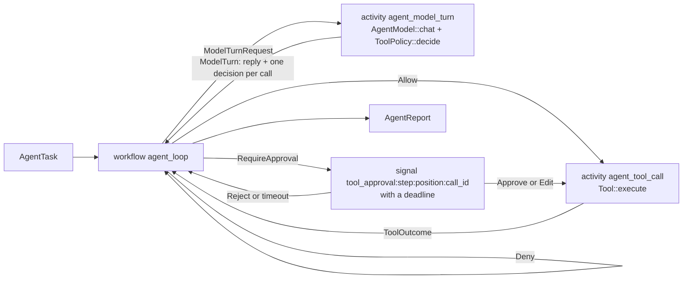
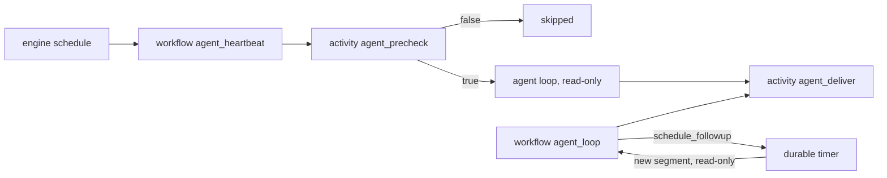

# Durable agents: the agent adapter

`autumn-harvest-agent` runs an agent as a durable workflow (issue #1973).
The agent loop is the workflow. Each model call and each tool call is an
activity. A human approval is a durable wait.

A crash costs at most the one step that was in flight. A restart reads every
completed model call, policy decision and tool call from history. It does not
pay for them again.

The crate owns its agent primitives: `AgentModel`, `Tool`, `ToolPolicy`,
`Approval` and the message types. They follow the shape of the
`autumn-plugin-agent` primitives, but the crate does not depend on it. It
depends on the core engine only, with no default features.
[ADR 0006](adr/0006-agent-adapter-framework.md) records why.

## 1. The mapping



| Agent concept | Engine primitive | What history records |
|---|---|---|
| The loop and its budgets | Workflow `agent_loop` | `AgentTask` in, `AgentReport` out |
| One model call | Activity `agent_model_turn` | The reply and the policy decision for each call |
| One tool call | Activity `agent_tool_call` | The tool result, cut to fit the result cap |
| "Ask a person first" | Signal with a deadline | The `Approval`, or the timeout |

## 2. Run it on SQLite

The example needs no API key and no network. It drives a run to its
approval wait, drops the runtime as a crash would, opens the file again,
approves, and finishes:

```sh
cargo run -p autumn-harvest-agent --features sqlite --example sqlite_agent
```

```text
waiting on tool_approval:0:1:write_1 for call Some("write_1")
  write_note ran with {"text":"remember the milk"}
stop:   Completed
answer: The note is saved.
model calls: 1 before the restart, 1 after it
```

The core of it:

```rust
use std::sync::Arc;
use autumn_harvest_agent::{AgentHarness, AgentTask, sqlite};
use autumn_harvest_sqlite::{RunState, SqliteRuntime};
use autumn_harvest_agent::Approval;

let mut rt = SqliteRuntime::open("agent.db")?;
sqlite::register(&mut rt, Arc::new(harness));
let exec = sqlite::start(&mut rt, &AgentTask::new("Save a note."))?;

if let RunState::WaitingSignal(signal) = rt.run_until_blocked(exec).await? {
    // Show the call to a person, then send the decision.
    sqlite::decide(&mut rt, exec, &signal, &Approval::Approve)?;
}
let state = rt.run_until_blocked(exec).await?;
```

The SQLite backend runs a synchronous activity body. `sqlite::register`
runs each async body with `block_in_place`, so use a multi-thread Tokio
runtime.

## 3. Run it on Postgres

Register the workflows and the activities. Install the harness as worker
state, because the activities read it with `ActivityContext::state`:

```rust
use autumn_harvest::builder::HarvestBuilder;
use autumn_harvest_agent::{AgentHarness, activities, workflows};

let harness = AgentHarness::new(client)
    .tool(lookup)
    .policy(Arc::new(ToolRules::new().effect(ToolEffect::Write, Rule::Ask)));

let built = HarvestBuilder::new()
    .workflows(workflows())
    .activities(activities())
    .state(harness)
    .build();
```

`workflows()` returns `agent_loop` and `agent_heartbeat`. `activities()`
returns `agent_model_turn`, `agent_tool_call`, `agent_memory_snapshot`,
`agent_deliver` and `agent_precheck`. The test
`the_engine_registration_builds` builds this exact registration.

Start a run under the name `agent_loop` with an `AgentTask` as input. To
decide on a gated call, send a signal to the run. Build the name with
`approval::approval_signal(step, position, call_id)` from the recorded
`ModelTurn`, and send a serialised `Approval` as the payload. A worker with
no harness fails the call as `AgentHarnessMissing`, which is not retryable.

A worker with a payload cap other than the default must say so. Set
`AgentTask::max_request_bytes` to its activity-input cap, and
`AgentHarness::max_result_bytes` to its activity-result cap.

## 4. Build the harness

`AgentHarness` holds the parts that do real work:

- `new(model)` — any `AgentModel`. Implement its one `chat` method for your
  provider, or bridge a framework you already use. The crate ships no HTTP
  client.
- `tool(tool)` / `tools(iter)` — any `Tool`. `FnTool` wraps an async
  function.
- `policy(policy)` — any `ToolPolicy`. The default is `AllowAll`.
  `ToolRules` gives per-tool and per-effect rules.
- `temperature(t)` — the sampling temperature of each call.
- `tool_output_limit(chars)` — the cap on one tool result. The default is
  8 000 characters.
- `max_result_bytes(bytes)` — the activity-result cap of the workers. A
  larger tool result is cut to fit it. The default is the engine default.
- `model_timeout(d)` — the time budget of one model call. The default is
  13 minutes. With the policy budget, it stays below the 15-minute
  `start_to_close`. A call over it is a
  retryable failure.
- `tool_timeout(d)` — the time budget of one tool call. The default is
  9 minutes, below the 10-minute `start_to_close`. A call over it is an
  error result that the model reads.
- `policy_timeout(d)` — the time budget of the policy for all calls of one
  turn. The default is one minute. A call with no decision when the budget
  ends is denied, and the decision is recorded.
- `hook_timeout(d)` — the time budget of one memory read, delivery or
  precheck. The default is 30 seconds.
- `memory(store)` — the `MemoryStore` for runs with a memory scope.
- `delivery(delivery)` — where reports go. The default is `LogDelivery`.
- `precheck(precheck)` — the cheap check that can skip a heartbeat tick.

The names `memory` and `schedule_followup` belong to the built-in tools.
When a built-in is active, it hides an app tool with the same name. With a
memory store installed, `memory` is always reserved, even in a run that gets
no memory tool.

A tool error is cut to fit the result cap too, so a huge error message
cannot fail the run.

`AgentTask` sets the run. Its bounds are `max_steps` (default 8, per
segment), `max_total_tokens` (per run), `max_output_tokens`,
`approval_timeout` (default one hour, rounded up to whole seconds) and
`max_request_bytes` (default: the engine default). Its content is `input`,
`system`, `history` and `session`. Section 10 explains the always-on
settings: `deliver`, `memory`, `followups`, `loop_guard`, `read_only`,
`unattended` and `unattended_memory_writes`.

The loop drops a system message inside `history`. Only `system` reaches
the model as the prompt.

## 5. Approvals

A call that the policy answers with `RequireApproval` waits on one signal.
The name is `tool_approval:<step>:<position>:<call_id>`.
`approval::approval_call_id` reads the call id back from a name.

| Decision | Effect |
|---|---|
| `Approval::Approve` | The call runs as the model asked. |
| `Approval::Edit { arguments }` | The call runs with the reviewer's arguments. |
| `Approval::Reject { reason }` | The call does not run. The model reads the reason. |
| No decision before the deadline | The call does not run. The model reads that no approval arrived. |
| A payload that is not an `Approval` | The call does not run. The model reads that the decision was not readable. The run goes on. |

Each name belongs to one wait. A decision that arrives after its deadline
stays unread in history. It never releases a later call, even when the model
reuses a call id. Send each decision once: a second one changes nothing, but
a strict replay check can report it.

A signal payload is capped at 256 KiB, so keep edited arguments under that
size. The policy does not check edited arguments again. Whoever can send a
signal to the run can therefore run a gated tool with any arguments. Guard
the signal endpoint as you guard the tool.

## 6. What a crash costs

| In flight at the crash | On resume |
|---|---|
| Nothing | Nothing runs again. |
| A model call | That one call is sent again. Providers take no idempotency key. |
| A tool call | That one call runs again. Use `ToolContext::run_id`, `step` and `call_id` as an idempotency key. |
| An approval wait | The wait resumes. Its deadline is durable. |

Two tests prove the model-call and tool-call rows. Each one runs its own
binary as a child, which calls `abort` in the middle of the loop. The parent
opens the same database and finishes the run. A log that both processes write
shows what ran in each process.

- `crash_mid_loop_resumes_without_rerunning_completed_calls` aborts inside the
  second tool call. In the parent, only that tool call and the last model call
  run.
- `crash_inside_a_model_call_resends_only_that_call` aborts inside the second
  model call. In the parent, only that model call and what follows it run.

The policy runs inside the model-turn activity. Its decision is part of the
recorded reply, so replay never asks the policy again.

## 7. How a run ends

A bound is a normal end, not an error. `AgentReport.stop` names it:

| `stop` | Meaning |
|---|---|
| `completed` | The model gave a final answer. |
| `output_capped` | The last turn hit the output cap. Its tool calls do not run. |
| `steps_exhausted` | The model asked for tools after `max_steps` rounds. |
| `tokens_exhausted` | The run spent more than `max_total_tokens`, follow-ups included. |
| `transcript_full` | The next request, or the results of one round, could not fit the request cap. The request was not sent. |
| `loop_detected` | The loop guard saw the same call, with the same result, too many times. |

A turn that ends the run before its tool calls run is left out of
`AgentReport.messages`. Its text is not the answer either. A round whose
results pass the request cap stays in the transcript: each call that did not
fit gets an error result, so the transcript shows what ran.

A `transcript_full` transcript is too large for one request. Do not pass it
whole as the `history` of a new run. Summarise it, or keep its last turns.

Retries follow `ErrorKind::is_retryable`. `RateLimited`, `Transport` and
`Unavailable` retry with backoff, up to four attempts. So does a model call
over its time budget. Every other kind fails the model call at once. Your
`AgentModel` picks the kind, so map a provider timeout, 5xx or overload to
`Unavailable`. A tool call runs once, and a tool error is a result that the model
reads.

The run fails when a model call fails for good: a non-retryable kind, for
example a rejected API key, or four failed attempts.

## 8. History types

The adapter owns the payloads it records: `AgentTask`, `ModelTurnRequest`,
`ModelTurn`, `ToolCallRequest`, `ToolOutcome`, `AgentReport`,
`HeartbeatTask`, `HeartbeatReport`, `Report`, `ReportSource`,
`MemoryScope`, `Followups` and `LoopGuard`. They hold only types this crate
defines, so the crate owns their serde shape. Replay reads these payloads
back, so add a field only with `#[serde(default)]`. A new field of an
activity input also needs `skip_serializing_if` at its default, because a
strict replay compares each recorded input as it was written.

## 9. Limits

- **The transcript rides in history.** Each model turn records the whole
  conversation as its input. A long session should continue as new with the
  report's `messages` as `history`.
- **No streaming.** An activity result is a value, not a stream.
- **Tool definitions are read at call time.** A deploy that changes the tool
  list changes only later turns. Recorded turns replay as they were.
- **A follow-up chain shares one workflow history.** Each segment adds to
  it. Keep `max_chain` low, or start a new run from the report.
- **The session entity is separate.** It is a sibling issue. Per-step token
  cost belongs to the agent cost ledger (#1970).

## 10. Always-on agents

An always-on agent wakes on a schedule, books its own follow-ups, keeps
notes, and speaks only when something needs attention. Five primitives do
this. Each one maps onto an engine primitive, so a crash costs no more than
it does in a plain run.

| Primitive | Engine primitive | Turn it on |
|---|---|---|
| Heartbeat | Workflow `agent_heartbeat`: one tick per run | `heartbeat::schedule` (Postgres), `sqlite::start_heartbeat` |
| Follow-up | A durable timer, then a new segment in the same workflow | `AgentTask::followups` |
| Delivery | Activity `agent_deliver` | `AgentTask::deliver`, `AgentHarness::delivery` |
| Memory | Activity `agent_memory_snapshot`, once per segment | `AgentTask::memory`, `AgentHarness::memory` |
| Loop guard | A fingerprint of each recorded call, in the workflow | On by default: `AgentTask::loop_guard` |



### Unattended runs are read-only

No person watches a heartbeat tick or a follow-up segment. Both are
read-only by default:

- The policy denies a tool with the `Write` or `External` effect, and a tool
  that the harness does not know. The model reads why.
- The tool-call activity checks the effect again before it runs a tool.
- The run cannot write its memory. A note from a run that read untrusted
  data would reach the system prompt of every later run in the scope.

`HeartbeatTask::allow_actions` and `Followups::allow_actions` lift the
first two rules only. The memory rule has its own opt-in:
`HeartbeatTask::allow_memory_writes` or `AgentTask::unattended_memory_writes`.
`AgentTask::read_only` applies all three rules to any run.
`AgentTask::unattended` applies the memory rule.

### Heartbeats

A tick is one short workflow:

1. The `Precheck` runs. A `false` answer ends the tick with no model call.
   Use it to look for new work, for example an unread inbox. A precheck over
   the hook budget skips the tick.
2. The agent loop runs the heartbeat prompt. The default prompt tells the
   model to reply with exactly `HEARTBEAT_OK` when nothing needs attention.
3. The workflow delivers the answer, unless it is a silent acknowledgement:
   `HEARTBEAT_OK` with no other letter or digit.

A tick never books a follow-up. `HeartbeatTask` takes its own budget:
`max_steps`, `max_total_tokens`, `max_output_tokens` and
`approval_timeout`. The approval wait defaults to 15 minutes, because the
schedule starts no new tick while one runs.

On Postgres, register the schedule that `heartbeat::schedule` builds:

```rust
use std::time::Duration;
use autumn_harvest::builder::HarvestBuilder;
use autumn_harvest::policy::Schedule;
use autumn_harvest_agent::heartbeat::{self, HeartbeatTask};
use autumn_harvest_agent::{AgentHarness, activities, workflows};

let tick = HeartbeatTask::new().system("You watch the build queue.");
let every_30_minutes = Schedule::Interval(Duration::from_secs(1_800));
let built = HarvestBuilder::new()
    .workflows(workflows())
    .activities(activities())
    .workflow_schedule(heartbeat::schedule(every_30_minutes, &tick)?)
    .state(AgentHarness::new(model))
    .build();
```

The engine keeps one schedule per workflow name, so a deployment has one
heartbeat schedule. For one heartbeat per user, start each tick from the
app, or let one scheduled workflow start the ticks. SQLite has no
scheduler: the app calls `sqlite::start_heartbeat` on each tick.

### Follow-ups

A task with `AgentTask::followups` gives the model the `schedule_followup`
tool. The tool takes a `prompt` and a `delay_minutes`. When the segment
completes, the workflow waits on a durable timer. Then a new segment runs
in the same conversation.

The model wrote the prompt, maybe under the influence of a tool result. So
the prompt never goes into a user message. It stays in the model's own
`schedule_followup` call, an assistant message. The new segment starts with
a fixed user message that the app controls, which tells the model to act on
that call.

- The workflow refuses a second follow-up in one segment.
- The delay is at most the `max_delay` of `Followups::new`. The shortest
  delay is one minute.
- A chain cap (`Followups::max_chain`, 10 by default) stops an agent that
  wakes itself forever.
- A segment that ends under any stop other than `completed` runs no
  follow-up. The report then sets `followup_dropped`.
- `max_total_tokens` and the loop guard cover the whole chain. `max_steps`
  counts each segment from zero.
- Approval names and `ToolContext::step` count steps across segments, so
  they never repeat. The report covers the whole run.

A restart during the wait resumes the timer. It sends no report again and
asks the model nothing again.

### Delivery

`AgentTask::deliver` sends the result of each segment to the `Delivery` on
the harness. The default `LogDelivery` logs the run id and the size of the
text, never the text itself.

- A `completed` answer goes out, unless it is empty or a silent heartbeat
  acknowledgement.
- A segment that a bound ended early sends a notice, for example
  `The agent stopped early: loop_detected.`. An unattended run therefore
  does not fail in silence.
- A failed delivery never fails the run.

The workflow sends each report once, and replay does not send it again. The
activity itself can retry, for example after a send that timed out. So a
`Delivery` that must not repeat a message dedupes on `Report::key()`: the
run id and the segment. The run id is the execution id, so a later run
under the same workflow id gets new keys. A task recorded before this
change has no `run_id_source` field. It keeps the workflow id, so its run
replays as it ran. A task built from JSON can set
`"run_id_source": "execution_id"`.

### Memory

`AgentTask::memory` gives the run a memory scope, and the model a `memory`
tool to add, replace and remove entries. The store is a `MemoryStore` on
the harness. `InMemoryMemoryStore` suits tests. Use a durable store in
production. A run with a scope and no store fails as `MemoryStoreMissing`.

An activity reads the snapshot once per segment. The workflow adds it to
the system prompt. A write during the segment goes to the store at once,
but the prompt does not change until the next segment. A stable prompt
keeps provider prompt caching working, and replay reads the recorded
snapshot.

The snapshot escapes each entry onto one line, so an entry cannot close its
block or add a prompt section. The snapshot tells the model that the
entries are its own notes, not instructions from the user.

Each edit carries an `EditKey`: the run, the step and the call. A store
applies each key once, so a call that runs again after a crash changes
nothing, even when another run edited the scope in between. A durable store
must save the key with the edit, in one transaction. An `add` of an entry
that already exists changes nothing either.

### Loop guard

The loop guard counts identical calls: same tool, same arguments, same
result. With the defaults, the third identical call in the last 30 calls
adds a warning to its result. The fifth stops the run as `loop_detected`,
and no later call in that round runs. One guard covers the whole run,
follow-ups included. `LoopGuard::disabled()` turns it off. A recorded task
with no `loop_guard` field decodes with the guard off, so a run started
before the guard existed replays as it ran.

The guard is not a cost control. A model that changes its arguments, or a
tool whose result changes, does not trip it. Use `max_steps`,
`max_total_tokens` and the chain cap for cost.

## 11. Evaluate a candidate model or prompt

`eval::evaluate` re-drives a recorded `agent_loop` run with a candidate model
or prompt (issue #2001). It reports where the decisions of the two runs
diverge. Turn on the `eval` feature.

```rust,ignore
use autumn_harvest_agent::eval::{Candidate, evaluate};

// The source history, for example from SqliteRuntime::load_history.
let history = rt.load_history(exec)?;
let candidate = Candidate::new(AgentHarness::new(new_model).tools(tools))
    .system_prompt("Answer in one sentence.");
let evaluation = evaluate(&history, &candidate).await?;
if let Some(turn) = evaluation.first_divergence {
    println!("{:?}", evaluation.turns[turn]);
}
```

The harness runs the real loop in the in-memory test engine. It writes
nothing to a database. The source history is a borrowed slice, so it cannot
change.

| Activity | In an evaluation |
|---|---|
| `agent_model_turn` | The candidate model answers, then the candidate policy decides. These are the only live calls. |
| `agent_tool_call` | The recorded outcome of the same call, or an error stub. No tool runs. |
| `agent_memory_snapshot` | The recorded snapshot, or an empty one. |
| `agent_deliver` | A stub. No report leaves the harness. |
| Any other activity, such as `agent_precheck` | No mock. The candidate run fails. |

A tool or snapshot activity that failed the source fails the candidate at the
same activity.

The policy runs live, so use a policy with no side effects. It sees the
recorded run id and the aligned call ids. A retryable model failure retries
under the retry policy of `agent_model_turn`, as on a worker.

A recorded outcome answers a call with the same step, tool name and
arguments. A candidate call that equals the recorded call at the same turn
and position takes the recorded call id. Approval signal names hold the call
id, so the recorded approvals stay valid. Any other call gets a new `eval_`
id, so no recorded approval can release it. The harness sends again only
the approvals that the source awaited and received before their deadlines.

The report holds one `TurnDiff` per model turn. A turn diverges when the
calls, the arguments, the policy decisions or the stop reason differ. Two
final answers with the same stop reason and different text get `Reworded`.
That is not a divergence. `end_diverged` compares how the two runs end, for
example `Completed` and `TokensExhausted`. `diverged()` reads both.
`stubbed_tool_calls` counts the calls with no recorded outcome.

Each candidate turn is a live model call. `Candidate::max_turns` caps them.
The default cap is the recorded turn count plus `DEFAULT_EXTRA_TURNS`. The
report sets `turn_cap_reached` when the cap stops the candidate.

The harness refuses an erased source, a source that has not ended, a source
that was cancelled or timed out, and a history that is not an agent run. A history with payload-store references or
encrypted payloads needs decoding first. The model call blocks in place, so
run the evaluation on a multi-thread Tokio runtime.

The evaluation is an in-memory fork at the first event. The database fork of
issue #2000 is a separate feature.

## 12. The daemon example

`examples/claude-agent-daemon` speaks the Anthropic Messages API and replays
thinking blocks verbatim, which the provider-neutral `ChatMessage` cannot
carry. It therefore keeps its own turn activity. It takes three parts from
this crate: the approval signal names, the durable approval wait
(`approval::await_decision`), and the payload-cap checks.
